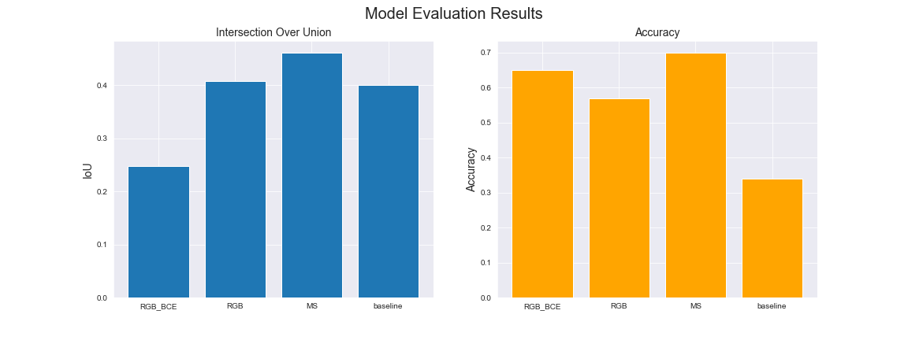
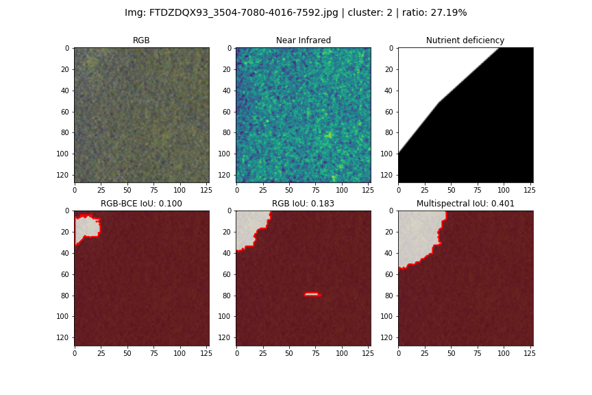
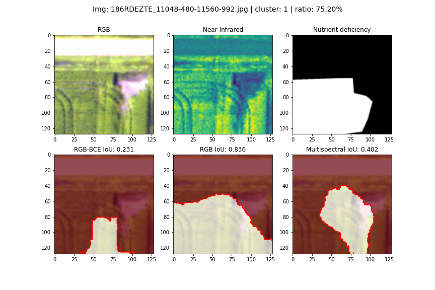

# **Executive Summary:** Identifying Nutrient Deficiencies in Satellite Farmland Imagery
## by [mr-steven-tran](https://github.com/mr-steven-tran)

---

## Problem Statement

Considering global population growth and failure to adequately mitigate the disastrous effects of global warming, one area of civilised society we must be be vigilant over is our food production.

Producers in the agriculture industry all over the world (especially in less developed industries) need all the help they can get to protect agricultural yields to ensure a stable supply of food for the populace. Maximizing crop yields and minimizing losses requires a solution for staying informed about crop and soil health.

>**Proposed Solution**: Use labelled satellite imagery and computer vision to identify patterns of ailments which negatively impact field conditions and crop yields.
For this project, I attempted to identify **nutrient deficiency** in satellite photography of croplands.

>**The task**: train a machine learning model to perform **binary semantic segmentation**, predicting pixels in an image as belonging to the **nutrient deficiency** class or not.

---

## Data

The data for this analysis came from the open source [AgricultureVision dataset](https://registry.opendata.aws/intelinair_agriculture_vision/) published in 2020. The original dataset consists of “94,986 images sampled from 3,432 farmlands”. The images were captured from 2017 through 2019, and the cameras used captured 4-channel field images consisting of Near-Infrared, Red, Green, and Blue color channels.

The publishers had five expert agronomists use software to annotate image regions with different crop ailments, including **nutrient deficiency**, the segmentation target for this project.

For model training, I limited the original dataset to the 2018 images which included nutrient deficiency annotations. This resulted in 14,712 RGB+Near-Infrared images, each with 512x512 size.

---

## The Model

In my research into available semantic segmentation models the two convolutional neural networks below seemed to be the best suited:
* **U-Net**
    * Great for semantic segmentation
    * Computationally inexpensive (by comparison)
    * Labelling requires region annotations only
* **Mask R-CNN**
    * Great for semantic and instance segmentation
    * Relatively simple to train (apparently)
    * Requires ground-truth bounding boxes

Because our dataset has region annotations and not bounding box annotations, **U-Net was the chosen model** for the semantic segmentation task.

---

## Modeling

**Goals**
* Define a *baseline* ‘predictive’ model for comparison purposes
    * I decided to go with with a ‘model’ that predicts every pixel as belonging to the nutrient deficiency class
* Train a U-Net segmentation model which can on average, produce better predictions than the baseline model
* Explore whether using the fourth imaging channel, Near-Infrared can be helpful for the segmentation task

**Process**
* Train the **U-Net** model on 90% of the image set
    * Once with RGB only, using binary crossentropy loss metric (for illustrative purposes as to why IoU makes for a better loss function for this type of task)
    * Once with RGB only, using IoU loss
    * Once with RGB + Near-Infrared channels, using IoU loss
    * Produce and evaluate nutrient deficiency predictions for the 10% validation image set

## Metrics

As eloquently reviewed by Ekin Tiu on [their post on **Towards Data Science**](https://towardsdatascience.com/metrics-to-evaluate-your-semantic-segmentation-model-6bcb99639aa2), accuracy may not be the best model evaluation metric for a semantic segmentation task.

For this project, **Intersection Over Union** or **Jaccard Similarity** was the chosen metric for evaluating model segmentation performance.

---

## Results

The results demonstrate that  

* Not only does the multispectral-input U-Net outperform the baseline in mean Intersection over Union, 
* It outperforms in mean validation accuracy compared to the baseline and the RGB model which was trained on minimizing the binary crossentropy

* Compared to the RGB-only U-Net IoU model, the results demonstrate that the added information of having the near-infrared 'color' channel generally aides the model in identifying areas with Nutrient Deficiency

---

## Review of the predictions

A case where the 4-channel model did really well where the human eye probably wouldn't:

A case where the 3-channel model performed better than the 4-channel model:

---

# Conclusions
* Using the Intersection over Union metric, the multispectral U-Net outperforms a baseline 'predictive' model
* For agricultural applications in identifying nutrient deficiency, it's clear that sometimes the Near-Infrared spectral channel is helpful, but sometimes it's not
* In some of the best examples shown, appearance of nutrient deficiency may not be apparent to the human eye, but the U-Net models used in this analysis demonstrate that machine learning great has potential for aiding in protection and optimization of crop yields

# Recommendations
* The image data were originally provided in 512x512 size, but were resized to 128x128 for training (for computational expense minimization). With greater computing power and more time, the model could likely become even better at identifying nutrient deficiency.
* It's conceivable that an ensemble model might be beneficial for this type of task: in some cases the model using the near-infrared spectral channel performed worse at classification than the model that only used the RGB channels. Ensemble Modeling may be helpful.
* RGB and near-infrared may not be the only imaging techniques that could be useful in this type of task. It could be beneficial to explore usage of other imaging methods (like UV and Infrared).
